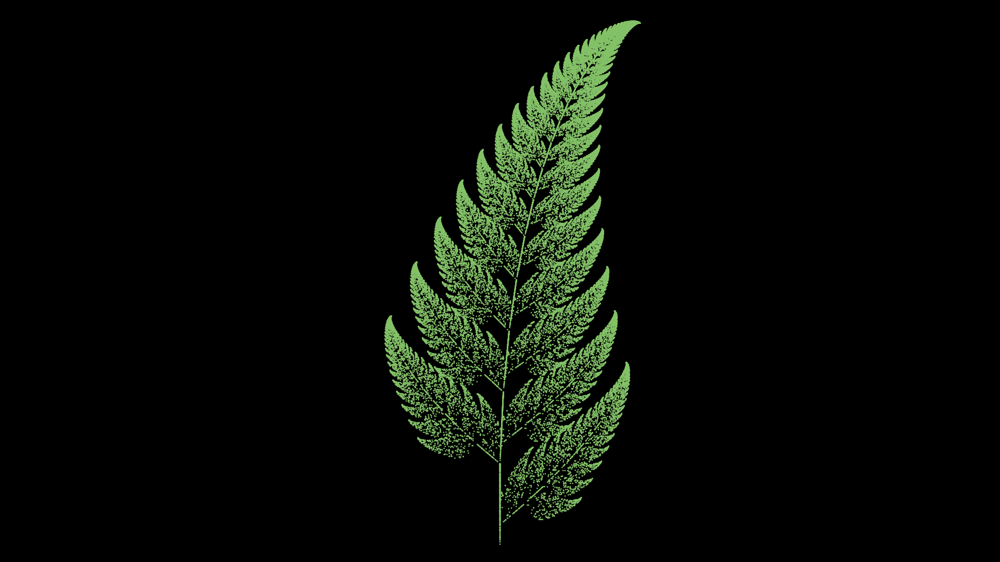

# BarnsleyFern



## Understanding what the Barnsley Fern is

The barnsley fern is a fractal which employs the theory that iterated functions
can be used to create geometric shapes.

# Requirements

For this project you will need Manim, see how to download Manim
[here](https://www.manim.community/) and some other requirements that may be
needed such as Python version

As of writing this Manim version 0.19.0 has been used

# Running the project

Once installed you can use

```
manim src/main.py BarnsleyFern
```

to run the project. This will generate an image file in `media/images/main`

Some recommended flags are:

  - `-qk` for maximum wuality
  - `-p` for quick preview once finished

To see the full list of possible flags click
[here](https://docs.manim.community/en/stable/guides/configuration.html)
